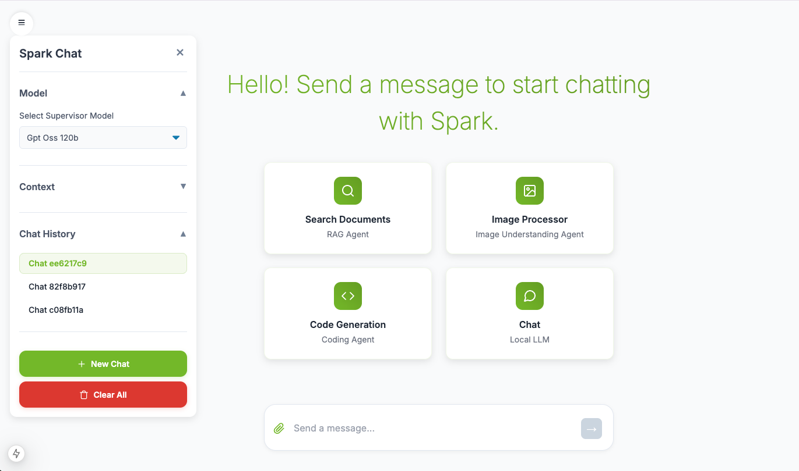

# Dell AI Multi-Agent Chatbot

[](https://opensource.org/licenses/Apache-2.0)
[](https://www.dell.com)
[](https://www.nvidia.com/en-us/data-center/dgx-platform/)

A sophisticated multi-agent AI chatbot system with Dell branding, optimized for NVIDIA DGX Spark. Features specialized agents for coding, document analysis (RAG), and image understanding, all orchestrated by a supervisor agent.



## 🌟 Features

- **🤖 Multi-Agent Architecture**: Supervisor agent orchestrates specialized downstream agents
- **💻 Code Generation**: Powered by Deepseek-Coder for intelligent code assistance
- **📚 RAG (Retrieval-Augmented Generation)**: Upload documents and query them with AI
- **👁️ Vision Understanding**: Analyze and describe images using Qwen2.5-VL
- **⚡ GPU Acceleration**: Optimized for NVIDIA GPUs with unified memory architecture
- **🎨 Dell Branded UI**: Modern, responsive interface with Dell color scheme
- **🔌 Extensible**: Easy to add new agents via Model Context Protocol (MCP)

## 🎯 What's Included

- ✅ Complete backend API (FastAPI)
- ✅ Modern frontend UI (Next.js + React) with Dell branding
- ✅ Docker Compose configuration for all services
- ✅ Model download scripts
- ✅ Pre-configured agent implementations
- ✅ Vector database setup (Milvus)
- ✅ Comprehensive documentation

## 🚀 Quick Start

### Prerequisites

- NVIDIA GPU with sufficient VRAM (128GB recommended for full setup)
- Docker & Docker Compose
- NVIDIA Container Toolkit
- ~80GB free disk space for models
- Linux environment (or WSL2 on Windows)

### Installation

```bash
# 1. Clone the repository
git clone https://github.com/tamereissa77/GB10-multiagent-chatbot.git
cd GB10-multiagent-chatbot

# 2. Download models (~74GB, 30min-2hrs depending on network)
chmod +x model_download.sh
./model_download.sh

# 3. Start all services (10-20 minutes)
docker compose -f docker-compose.yml -f docker-compose-models.yml up -d --build

# 4. Wait for containers to be healthy
docker ps

# 5. Access the application
# Open browser: http://localhost:3000
```

## 📚 Documentation

Comprehensive guides for different scenarios:

- **[START_HERE.md](START_HERE.md)** - Navigation guide and quick links
- **[DGX_SPARK_INSTALL.md](DGX_SPARK_INSTALL.md)** - DGX Spark specific installation ⭐
- **[GETTING_STARTED.md](GETTING_STARTED.md)** - Step-by-step checklist
- **[SETUP_GUIDE.md](SETUP_GUIDE.md)** - Detailed Linux setup
- **[WINDOWS_SETUP.md](WINDOWS_SETUP.md)** - Windows/WSL2 setup
- **[QUICK_REFERENCE.md](QUICK_REFERENCE.md)** - Command cheat sheet
- **[DELL_BRANDING_GUIDE.md](DELL_BRANDING_GUIDE.md)** - Dell branding details
- **[DELL_BRANDING_CHANGES.md](DELL_BRANDING_CHANGES.md)** - Branding change summary

## 🏗️ Architecture

```
┌─────────────────────────────────────────────────────────────┐
│                    Frontend (Next.js)                        │
│                  http://localhost:3000                       │
└────────────────────────────┬────────────────────────────────┘
                             │
                             ▼
┌───────────────────────────────────────────────────────��─────┐
│                Backend API (FastAPI)                         │
│                  http://localhost:8000                       │
│  ┌──────────────────────────────────────────────────────┐  │
│  │         Supervisor Agent (gpt-oss-120B)              │  │
│  │                                                       │  │
│  │  ┌─────────────┐  ┌─────────────┐  ┌─────────────┐ │  │
│  │  │   Coding    │  │     RAG     │  │   Vision    │ │  │
│  │  │   Agent     │  │    Agent    │  │   Agent     │ │  │
│  │  │ (Deepseek)  │  │  (Qwen3)    │  │ (Qwen2.5)   │ │  │
│  │  └─────────────┘  └─────────────┘  └─────────────┘ │  │
│  └──────────────────────────────────────────────────────┘  │
└────────────────────────────┬────────────────��───────────────┘
                             │
        ┌────────────────────┼────────────────────┐
        ▼                    ▼                    ▼
┌──────────────┐    ┌──────────────┐    ┌──────────────┐
│  PostgreSQL  │    │    Milvus    │    │  Model       │
│  (Storage)   │    │  (Vectors)   │    │  Servers     │
└──────────────┘    └──────────────┘    └──────────────┘
```

## 🎨 Dell Branding

This project features Dell's corporate branding:

- **Primary Color**: Dell Blue (#0076CE)
- **Accent Colors**: Dell Orange, Dell Green
- **Typography**: Dell Sans (with fallbacks)
- **UI Elements**: All buttons, links, and interactive elements use Dell colors

See [DELL_BRANDING_GUIDE.md](DELL_BRANDING_GUIDE.md) for complete details.

## 🎮 Usage Examples

### 1. General Conversation

Simply type your question:
```
"What is machine learning?"
"Explain quantum computing"
```

### 2. Code Generation

Ask for code help:
```
"Write a Python function to calculate fibonacci numbers"
"Create a REST API endpoint using FastAPI"
```

### 3. Document Analysis (RAG)

1. Click "Upload Documents" in the sidebar
2. Upload a PDF file
3. Check the box in "Select Sources"
4. Ask questions:
```
"Summarize the main points of the document"
"What does the document say about [topic]?"
```

### 4. Image Understanding

1. Upload an image
2. Ask questions:
```
"What objects are in this image?"
"Describe this picture in detail"
```

## 🔧 Configuration

### Using Smaller Models

If you have memory constraints, switch to gpt-oss-20B:

1. Edit `model_download.sh` - comment out gpt-oss-120b, uncomment gpt-oss-20b
2. Edit `docker-compose-models.yml` - comment out `gpt-oss-120b` service, uncomment `gpt-oss-20b`
3. Edit `docker-compose.yml` - change `MODELS=gpt-oss-120b` to `MODELS=gpt-oss-20b`

See [SETUP_GUIDE.md](SETUP_GUIDE.md) for detailed instructions.

## 📊 System Requirements

### Minimum Requirements
- NVIDIA GPU with 64GB+ VRAM
- 64GB+ RAM
- 200GB free disk space
- Docker with GPU support

### Recommended (DGX Spark)
- 128GB unified memory
- 200GB+ free disk space
- High-speed internet for model downloads

## 🛠️ Development

### Project Structure

```
GB10-multiagent-chatbot/
├── backend/                    # FastAPI backend
│   ├── agent.py               # Agent orchestration
│   ├── client.py              # LLM client wrappers
│   ├── main.py                # FastAPI app
│   ├── vector_store.py        # Milvus integration
│   └── tools/                 # MCP servers
├── frontend/                   # Next.js frontend
│   ├── src/
│   │   ├── app/               # Pages
│   │   └── components/        # React components
│   └── Dockerfile
├── docker-compose.yml         # Main services
├── docker-compose-models.yml  # Model servers
└── model_download.sh          # Model downloader
```

### Running in Development Mode

```bash
# Backend (with hot reload)
cd backend
pip install -e .
uvicorn main:app --reload --host 0.0.0.0 --port 8000

# Frontend (with hot reload)
cd frontend
npm install
npm run dev
```

## 🧪 Testing

```bash
# Test backend health
curl http://localhost:8000/health

# Test chat endpoint
curl -X POST http://localhost:8000/chat \
  -H "Content-Type: application/json" \
  -d '{"message": "Hello", "conversation_id": "test"}'

# View API documentation
open http://localhost:8000/docs
```

## 🐛 Troubleshooting

### Common Issues

**Containers won't start:**
```bash
docker logs <container-name>
docker compose -f docker-compose.yml -f docker-compose-models.yml restart
```

**Out of memory:**
```bash
# Check memory
free -h
nvidia-smi

# Flush cache (DGX Spark)
sudo sh -c 'sync; echo 3 > /proc/sys/vm/drop_caches'
```

See [QUICK_REFERENCE.md](QUICK_REFERENCE.md) for more troubleshooting tips.

## 🧹 Cleanup

```bash
# Stop all services
docker compose -f docker-compose.yml -f docker-compose-models.yml down

# Remove volumes (complete cleanup)
docker compose -f docker-compose.yml -f docker-compose-models.yml down -v

# Remove downloaded models
rm -rf models/
```

## 🤝 Contributing

Contributions are welcome! Please feel free to submit a Pull Request.

1. Fork the repository
2. Create your feature branch (`git checkout -b feature/AmazingFeature`)
3. Commit your changes (`git commit -m 'Add some AmazingFeature'`)
4. Push to the branch (`git push origin feature/AmazingFeature`)
5. Open a Pull Request

## 📄 License

This project is licensed under the Apache License 2.0 - see the LICENSE file for details.

Based on [NVIDIA DGX Spark Playbooks](https://github.com/NVIDIA/dgx-spark-playbooks).

## 🔗 Resources

- [NVIDIA DGX Spark Documentation](https://docs.nvidia.com/dgx/)
- [Model Context Protocol](https://modelcontextprotocol.io/)
- [llama.cpp](https://github.com/ggerganov/llama.cpp)
- [TensorRT-LLM](https://github.com/NVIDIA/TensorRT-LLM)
- [Milvus Vector Database](https://milvus.io/)
- [FastAPI](https://fastapi.tiangolo.com/)
- [Next.js](https://nextjs.org/)

## 🙏 Acknowledgments

- NVIDIA for the DGX Spark platform and playbooks
- Dell for branding guidelines
- The open-source AI community
- Contributors to llama.cpp, TensorRT-LLM, and Milvus

## 📞 Support

For issues and questions:
- Check the [documentation](START_HERE.md)
- Review [troubleshooting guide](QUICK_REFERENCE.md)
- Open an issue on GitHub

## 🗺️ Roadmap

- [ ] Add more specialized agents
- [ ] Support for additional model formats
- [ ] Enhanced UI features
- [ ] Performance optimizations
- [ ] Multi-user support
- [ ] Cloud deployment guides
- [ ] Dell logo integration
- [ ] Dell Sans font integration

---

**Built with ❤️ for Dell and the AI community**

**Status**: ✅ Production Ready | **Last Updated**: January 2025
